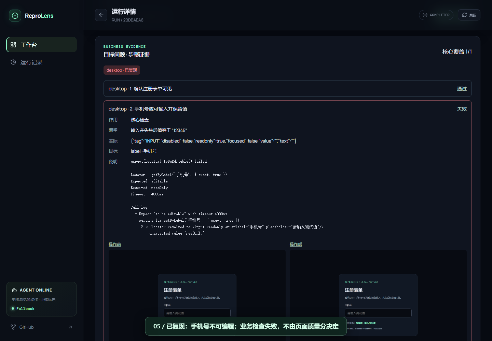

# ReproLens

> 将 Web Bug 描述转化为可确认的业务检查、真实浏览器证据和回归测试。

面向前端开发者、测试工程师和开源维护者的可视化 Bug 复现工具。输入目标页面、问题与期望结果，确认计划后由 Playwright 执行，并展示每一步的期望、实际结果和截图。

[](https://nodejs.org/)
[](https://react.dev/)
[](https://playwright.dev/)
[](LICENSE)

## 操作演示

[](docs/media/reprolens-demo.webm)

[▶ 观看 / 下载视频（约 41 秒，WebM）](docs/media/reprolens-demo.webm)

输入框无法输入 → 确认计划 → 真实执行 → 查看失败证据 → 修复后重放 → 核心检查通过。

视频使用本地真实 API 和 Chromium，带中文字幕、无配音；采用无 Key 安全模板并人工确认定位，不演示模型规划。如果无法直接播放，请下载后打开。

## 当前版本：v0.5.0

**业务断言驱动的复现**：围绕用户指定的问题执行检查，页面质量报告只作为补充，不用于判断目标 Bug 是否复现。

- **确认计划**：编辑前置场景、目标控件、动作、测试值和核心检查项；DeepSeek 可辅助规划，无 Key 时提供待编辑的安全模板。
- **真实执行**：支持键盘输入与失焦后值验证，以及文本、状态、URL 和受限响应检查；目标不唯一或前置条件失败时报告证据不足。
- **可视化证据**：多设备截图、实时执行时间线，以及逐步的通过、失败、受阻和跳过状态。
- **修复验证**：重放已确认的计划，检查修复后的业务结果，并提供 Before / After / Pixel Diff 辅助对比。
- **测试与协作**：生成 Playwright 回归测试，支持 GitHub Issue 导入和结果发布；未确认计划的自动任务不能证明目标问题。
- **附加质量报告**：WCAG、Web Vitals、Console / Network 证据、质量门禁与趋势。

当前为用户确认的顺序计划，不支持动态分支重规划。定位建议需人工核对；“此路径未复现”不等于全站无 Bug，“已生成测试”不等于已运行验证。

## 快速开始

需要 Node.js 20+（推荐 22）。以下命令在仓库根目录执行，Windows PowerShell、macOS 和 Linux 通用。

```sh
npm install
npm run browser:install
npm run dev
```

打开 [http://localhost:5173](http://localhost:5173)，填写问题 → 点击“生成复现计划” → 编辑并确认检查项 → 点击“按确认计划执行”。

**可选模型配置**：将 `.env.example` 复制为 `.env`（已有则跳过），填写 `DEEPSEEK_API_KEY` 后启动或重启服务。不配置也能使用安全模板和浏览器执行。

复制命令：Windows 使用 `Copy-Item .env.example .env`；macOS / Linux 使用 `cp .env.example .env`。

**构建后运行**：

```sh
npm run build
npm start
```

打开 [http://127.0.0.1:8787](http://127.0.0.1:8787)，API 同时托管前端。项目面向本地使用，不提供在线任务提交服务。

## 开发与验证

```sh
npm run check
```

执行单元测试及前后端构建。浏览器专项验证和已知限制见 [测试报告](docs/TEST_REPORTS.md)。

重新录制演示：先执行 `npm run build`，再运行 `node scripts/record-demo.mjs`。脚本使用隔离的本地服务与测试页面，不调用模型或覆盖已有任务；更新 `docs/media` 中的视频和封面，执行证据保留在终端输出的临时目录。

## 项目与文档

- `apps/web`：React 工作台、计划编辑、运行记录和证据展示。
- `apps/api`：任务管理、Playwright 执行、业务断言、质量分析与 GitHub 集成。
- `scripts`：验证与录制工具；`data/runs`、`artifacts`：本地任务和截图。

[版本说明与当前设计](docs/VERSIONS.md) · [产品说明](docs/PRODUCT_SPEC.md) · [架构文档](docs/ARCHITECTURE.md) · [测试报告](docs/TEST_REPORTS.md)

GitHub 集成配置见 [仓库配置](.github/reprolens.yml) 和 [Actions 工作流](.github/workflows/reprolens.yml)。本地发布结果需要配置 `REPROLENS_GITHUB_TOKEN`；自动任务仍受计划确认限制。

## 安全与许可

仅对已授权的本机或可信测试环境运行。直接开放公网前，需要补齐身份认证、目标地址限制和任务配额。不要提交真实密钥、个人信息或敏感截图；`.env` 和运行数据默认被 Git 忽略。

[MIT License](LICENSE)
